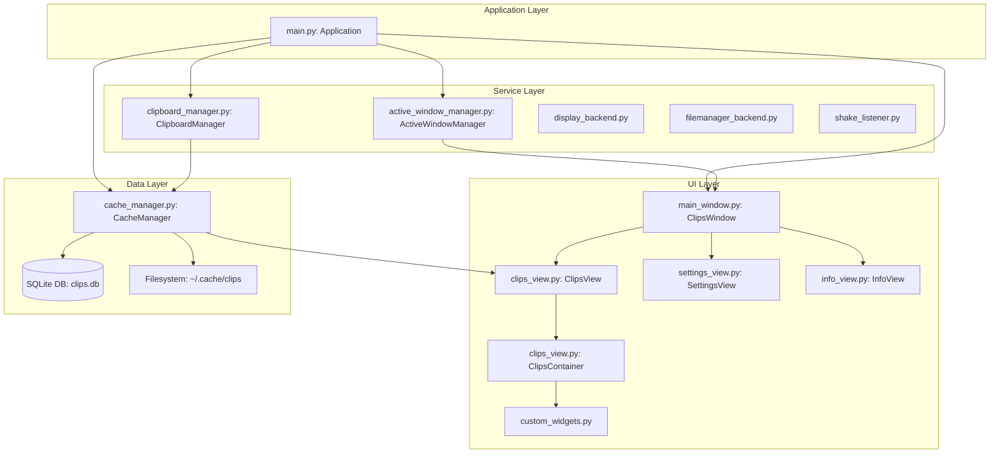

# Architecture Diagram: Clips

This document provides a high-level overview of the architectural structure of the Clips application, a clipboard manager for GTK-based desktops.

## Architectural Overview

The Clips application follows a layered architectural pattern, separating UI concerns from business logic and data persistence.

## Component Breakdown

### 1. Application Layer
- **[main.py](file:///home/adi/Projects/clips/src/main.py)**: The entry point of the app. It initializes the `Gtk.Application`, sets up global services (Cache, Clipboard, Window Managers), and handles application-wide actions and shortcuts.

### 2. UI Layer
- **[main_window.py](file:///home/adi/Projects/clips/src/main_window.py)**: The primary window ([ClipsWindow](file:///home/adi/Projects/clips/src/main_window.py#15-477)). It manages the top-level layout, including the `Gtk.Stack` for switching between the Clips view, Settings, and Info views.
- **[clips_view.py](file:///home/adi/Projects/clips/src/clips_view.py)**: Contains [ClipsView](file:///home/adi/Projects/clips/src/clips_view.py#22-283), which manages the `Gtk.FlowBox` of clipboard items, and [ClipsContainer](file:///home/adi/Projects/clips/src/clips_view.py#285-888), the individual entry widget.
- **[custom_widgets.py](file:///home/adi/Projects/clips/src/custom_widgets.py)**: Reusable UI components used across the application to maintain a consistent look and feel.

### 3. Service Layer
- **[clipboard_manager.py](file:///home/adi/Projects/clips/src/clipboard_manager.py)**: Interfaces with the system clipboard. It handles different content types (text, images, HTML) and filters out excluded applications.
- **[active_window_manager.py](file:///home/adi/Projects/clips/src/active_window_manager.py)**: Tracks the currently active window to associate clipboard copies with their source application.
- **[display_backend.py](file:///home/adi/Projects/clips/src/display_backend.py)**: Detects whether the app is running on X11 or Wayland to customize behavior (e.g., clipboard monitoring implementation).

### 4. Data Layer
- **[cache_manager.py](file:///home/adi/Projects/clips/src/cache_manager.py)**: The heart of the data handling. It manages the SQLite database for metadata and the filesystem cache for the actual clipboard content (images, large text files, screenshots).

## Data Flow: Capturing a New Clip

1. **System Clipboard Event**: The system triggers an "owner-change" event.
2. **Clipboard Monitoring**: [CacheManager](file:///home/adi/Projects/clips/src/cache_manager.py#22-809) (via [ClipboardManager](file:///home/adi/Projects/clips/src/clipboard_manager.py#14-235)) receives the signal.
3. **App Context**: `ActiveWindowManager` identifies the source application.
4. **Processing**: [ClipboardManager](file:///home/adi/Projects/clips/src/clipboard_manager.py#14-235) extracts and validates the data based on supported types.
5. **Persistence**: [CacheManager](file:///home/adi/Projects/clips/src/cache_manager.py#22-809) generates a checksum, saves the content to the filesystem, and adds a record to the SQLite database.
6. **UI Update**: [CacheManager](file:///home/adi/Projects/clips/src/cache_manager.py#22-809) notifies [ClipsView](file:///home/adi/Projects/clips/src/clips_view.py#22-283) via `GLib.idle_add` to add a new [ClipsContainer](file:///home/adi/Projects/clips/src/clips_view.py#285-888) to the UI.
