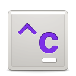

<div align="center">



</div>

[](https://travis-ci.com/hezral/clips)

If you like what i make, it would really be nice to have someone buy me a coffee
<div align="center">
<a href="https://www.buymeacoffee.com/hezral" target="_blank"></a>
</div>

### Multi format clipboard manager with extra features
#### Supported formats:
* Plain text
* Rich text
* HTML text
* Word, Spreadsheet, Slides
* Images
* File manager
* Internet URL text
* Mail URL text
* Color codes: rgb(a), hsl(a), hex

#### Extra features:
* Exclude copy events from certain apps
* Protect passwords on copy
* Keyboard shortcuts for navigation, actions
* Housekeeping


|  |  |
|------------------------------------------|-----------------------------------------|

## Installation

## Build using flatpak
* requires that you have flatpak-builder installed
* flatpak enabled
* flathub remote enabled

```
flatpak-builder --user --force-clean --install build-dir com.github.hezral.clips.yml
```

### Build using meson 
Ensure you have these dependencies installed

* python3
* python3-gi
* python3-cryptography
* python3-keyring
* libgranite-dev
* bamfdaemon
* libbamf3-2
* libbamf3-dev
* libwnck-3-dev
* libwebkit2gtk-4.0-dev
* python3-gi-cairo
* python3-gi-cairo-dev
* python-xlib
* xclip
* xprop


Download the updated source [here](https://github.com/hezral/clips/archive/master.zip), or use git:
```bash
git clone https://github.com/hezral/clips.git
cd clips
meson build --prefix=/usr
cd build
ninja build
sudo ninja install
```
The desktop launcher should show up on the application launcher for your desktop environment
if it doesn't, try running
```
com.github.hezral.clips
```

## Thanks/Credits
- [ElementaryPython](https://github.com/mirkobrombin/ElementaryPython) This started me off on coding with Python and GTK
- [Lazka's PyGObject API Reference](https://https://lazka.github.io) The best documentation site for coding with Python and GTK